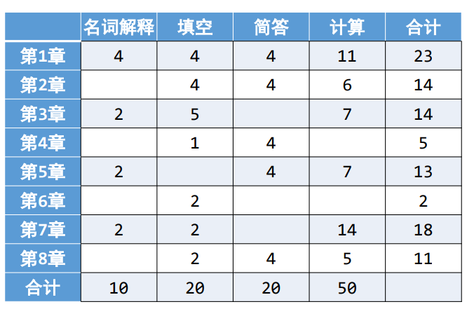

# 大三课程介绍

## 大三上课程

### 优化方法基础COM550105

2021级授课老师lmn

课程也被称为凸优化

课程有挑战性

平时作业基本是计算题，建议学习一下怎么用latex写

考试：有样题

### 计算机网络COMP461205

2021级授课老师zwz

平时作业课后题，计算为主

论文分享：小组形式，分享顶会论文，做ppt上去讲

实验(软件+硬件)

硬件：去机房线下做，次数多，小组形式，期末前写报告

软件：自己做，写报告

考试 不少题目类似408考研题，有样题

### 操作系统COMP400627

2021级授课老师qy

作业：概念较多

实验：gitee上操作，建议学一下git和patch那些怎么用

考试需要背诵一些概念。题目类似样题。

### 计算机组成原理COMP461805

2021级授课老师zkw

作业：课后题

实验(模拟MIPS+流水线等)

考试 类似样题。建议平时好好听，据说突击不太行。

## 大三下课程

### 认知计算与机器学习COMP460905

2021级授课老师bjp

课堂表现：考勤和回答问题

作业：概念居多

实验(三次线下去相应机房，每次做完现场验收，回去要写报告)

第一次：基本张量操作，cifar10下载加载展示

第二次：聚类分析，k-means和DBSCAN，数据为cifar10

第三次：神经网络。CNN和LSTM，GRU等。图像任务和时序预测任务。

论文阅读和分享。阅读顶会论文，制作ppt，分享。

小任务：自己选一个相应的较大的任务（一般是一个机器学习/深度学习任务，如人脸识别和图像分类）

考试 类似样题

### 数据库系统COMP461405

2021级授课老师rxb

平时30% 期末70%

作业：课后题，有习题课，期末前发作业题答案。

有实验。验收+报告。

期末会勾画重点，题目有的类似作业题。

### 计算机体系结构COMP461505

2021级授课老师ch

平时： 20%，（包含：平时作业15%，课堂考勤和参与5%）
 
实验（上机）：  20%；（包含：4次实验）
 
期末： 60%

考试类似作业题和辅导书题目。

2021级考点分布图如下：

### 人工智能导论COMP400527

2021级授课老师zll

平时30%+期末70%

平时：三次作业。考勤，会不定时点名。

考试：填空(30分)，大题(70分) 基本为ppt内容，大题类似ppt中题目。

### 数值分析

2021级授课老师mj

平时20% + 考试80%

平时 考勤+作业两次

考试 类似样题，看起来不难

### 软件定义网络COMP550705
专业选修课(2学分)

2021级授课老师zp

4次实验（难度看似依次变高），无考试

现场验收+实验报告
